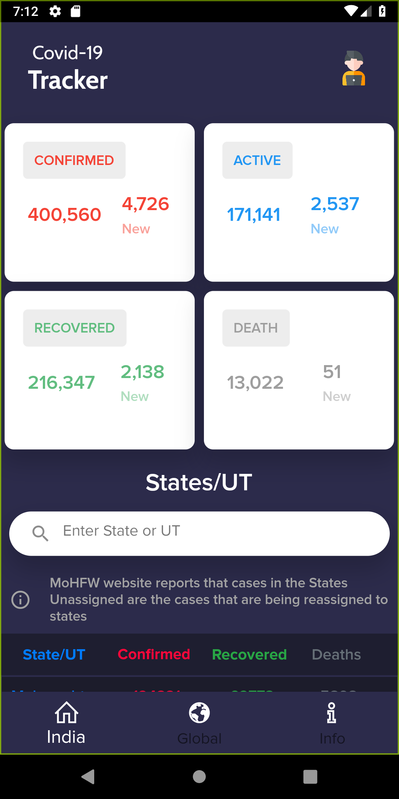
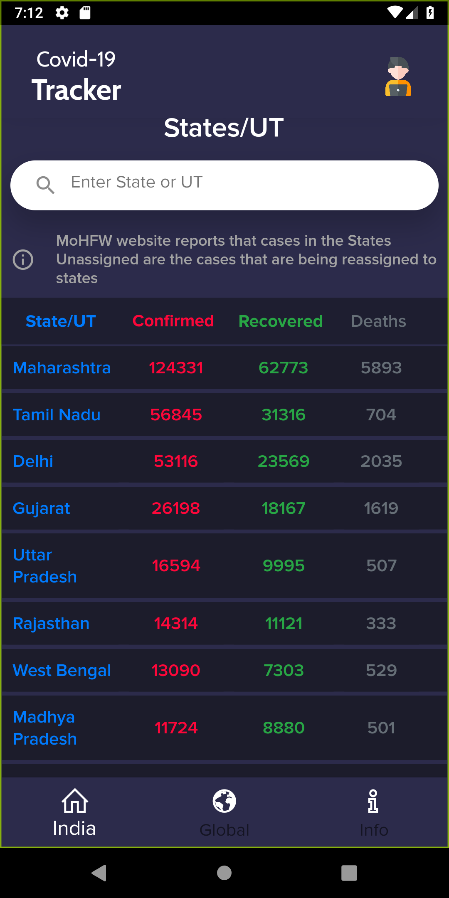
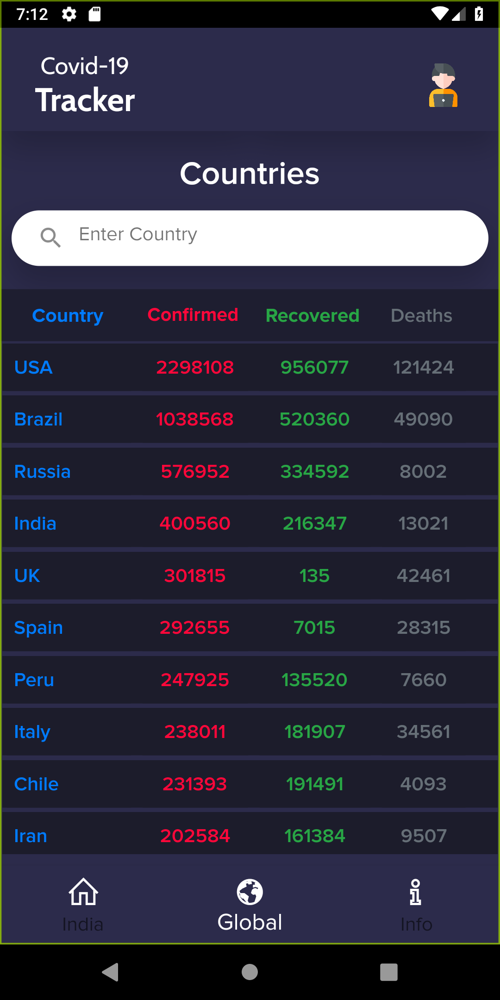

# Covid_19_Tracker

A Covid-19 Tracker built using Flutter. It shows stats of Indian states and Global countries. There is also an information section which shows the symptoms of covid 19 and prevention of covid 19.

## Screenshots

 
 
 
